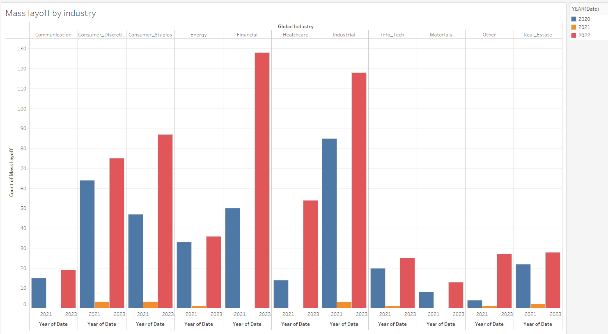
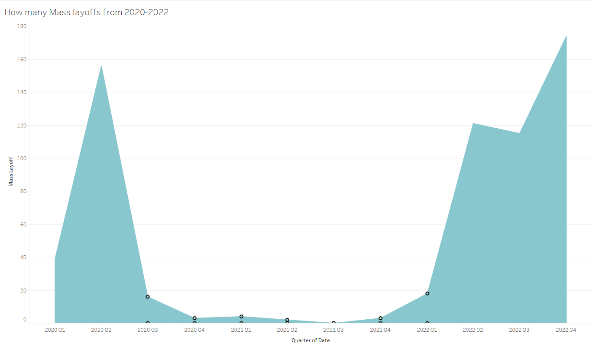
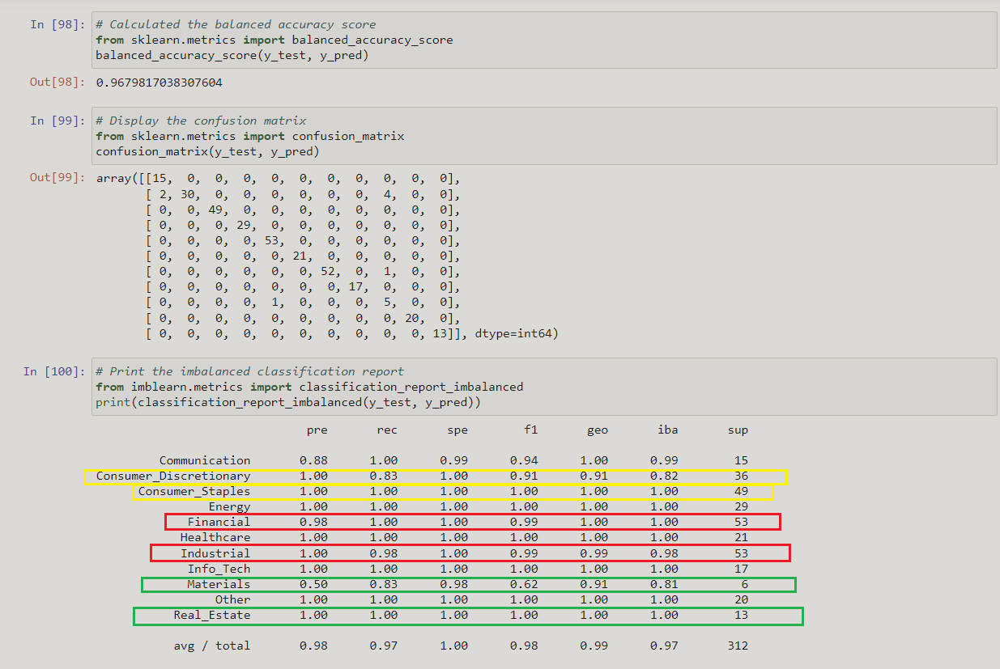
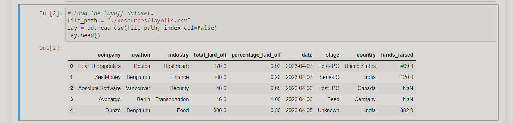
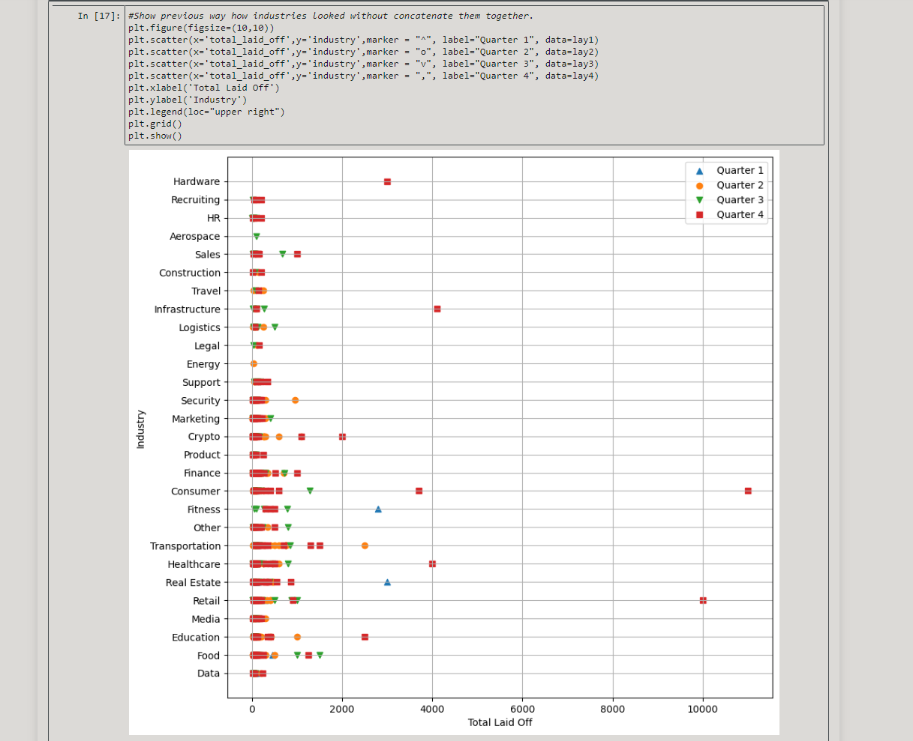
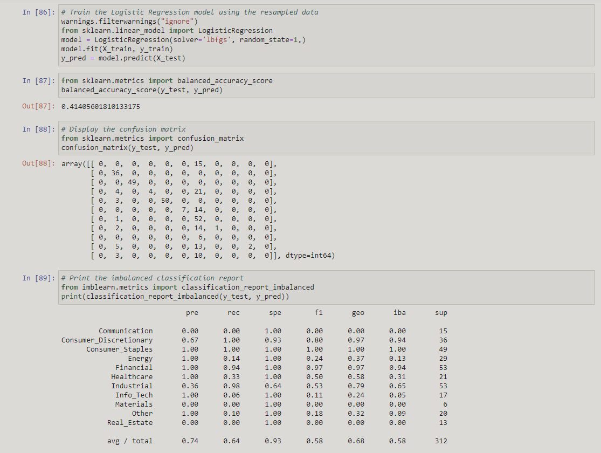
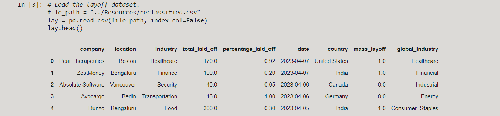
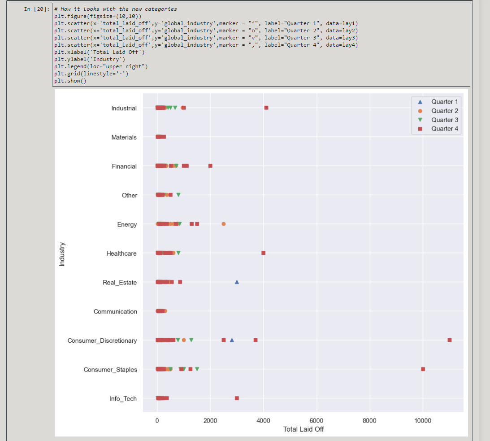
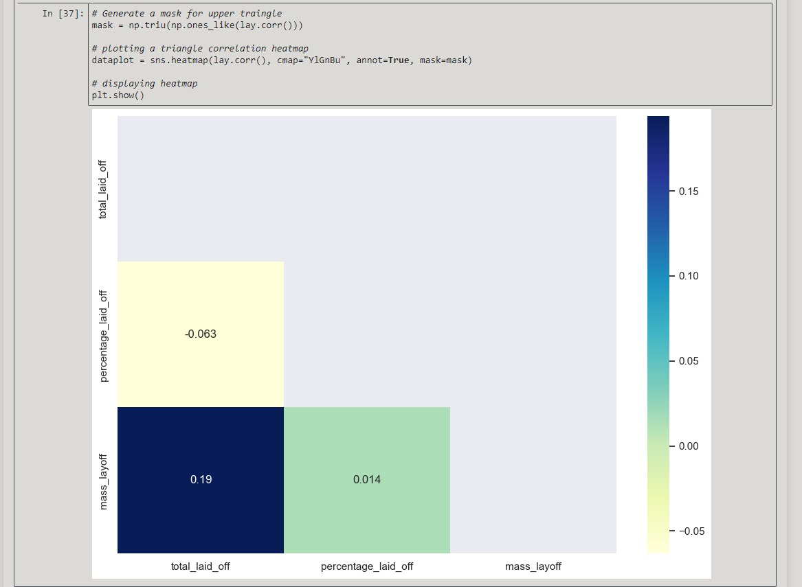

# Mass Layoffs
## The Reasoning Behind our Topic 
- Why did we choose the subject of Mass Layoffs?  When you watch the news lately it seems that mass layoffs have been a very hot topic. 
- We were curious to see what may have caused this wave of mass layoffs and questioned if it had any correlation with the COVID pandemic. 
- We also then thought if we could find a pattern in our data over the last three years maybe we could predict what might be the next 
- industry to be next on the list.

## Our Data Set

- We found our data in Kaggle which fit perfectly with what we had been questioning.  The mass layoff data set that was in Kaggle ranged
- from the start of the pandemic (official start date of March 11, 2020) until April 7th, 2023.  Kaggle had the CSV but the site that 
- originally held the data is Layoffs.fyi.  This site compiled all this information via websites such as Bloomberg, The New York Times, 
-Tech Crunch and the list goes on.  We felt that this data then was very safe to review and use for our analysis. 

# Analysis

- When the pandemic started in March of 2020 there were a few initial industries that were victims of the new norm, Consumer Discretionary
- (construction, education, fitness, manufacturing, travel), Consumer Staples (food and retail), Industrial 
- ( aerospace, HR, infrastructure, legal, logistics, marketing, recruiting, sales and security) and Financial.  
- These industries had over 45 mass layoffs during this period.  

- What then struck us when looking over the full data from 2020 to 2023 was that there was a year long period that there were hardly any mass 
- layoffs. Basically, from April 2020 until December 2021 the mass layoffs were not anything people needed to worry about.  This led us to wonder why? 
- During this time many of us stayed at home and didn’t go out if only for necessity.  After doing research we discovered the government had 
- a program that started in April 2020 and lasted until May 2021.  This program was called the Paycheck Protection Plan (PPP) 
- which gave money to any business that employed 500 or less workers.  This program stated that as long as you kept your employees and 
- didn’t lay them off your PPP loan would be 100% forgiven.  During this time the US government gave out $800 billion dollars to these businesses 
- that kept people employed.  

- Once the program ran its course is when we start seeing the rapid rise starting in January of 2022 of the mass layoffs in various industries.  
- This is where we tried to analyze what would be the next industry that may be hit by mass layoffs.  

--------Show our work/graphs/tableau.-------

## Prediction 

-Once we did our machine learning  we were able to get our accuracy up to .967, which we were very happy about.  What it shows is that 
- the next industries that may be looking to take in more mass layoffs are Financial, Industrial and Consumer Staples.  This may not 
-be a total surprise just because of all the recent recession talk.  
 
 
 
## Issues

- Our data was really excellent, but it did have some issues initially.  We had null fields and even a couple columns that held no value to them.  

- Once we cleaned that up and started to dig deeper, we noticed that we had two columns that gave us the percentage of workers laid off and
- also the total number laid off.  This made us wonder what would be considered a mass layoff?  The issue being a big company like Google 
- could layoff thousands of workers but that would only be 5% of their staff but a smaller company may lay off 50 employees and that may be
- 50% of their staff.  We researched and the US Government states that a mass layoff is any reduction in workers of over 50. This is based off 
- the Worker Adjustment and Retraining Notification Act in 1988 (WARN ACT).  With that information in hand we then created a new column in our
- data set that would calculate if there were more than 50 people laid off, then it would be a mass layoff and if not, it wasn’t a mass layoff
- and we couldn’t use that data.

- Our next issue came up as we started to graph our data.  We just had too much information it seemed, as you can see in the scatter graph below.

- Even our machine learning was struggling to get a good percentage for us.

- Once again we inspected the data and noted that in our industry column, we just had too many industries that could be combined.  That led
- us again to wonder how should we combine these industries?  Another search gave us the Global Industry Classification Standard (GICS) which
- gave us a table on how to align our industry and reclassify it into a much more concise group.  From over 30 industries we were able to bring 
- it down to 11.  Once we were able to do that, our modeling and graphing started to make sense and was a lot cleaner.  We made a new column in 
- our data frame called "global industry". 

- And with that our graphs started to make sense and look a lot better as the image below shows after the update. 

- We did have some limitation as well, we only had three integer columns which made the machine learning difficult initially and made 
- heat maps not very warm let along hot.

# Conclusion

-After reviewing all the data we may be able to feel slightly more comfortable because we took this course and maybe we’ll be able to avoid 
- this possible mass layoffs to come.  If we had a bit more time to work on this we could have really dug deeper into our data because 
-there were some anomalies of industries that were fit into an “other” category.  If we had more time we’d have been able to group them
-into the correct industry but we had over 1200 companies and we didn’t have the time to go through the “other” category.  

